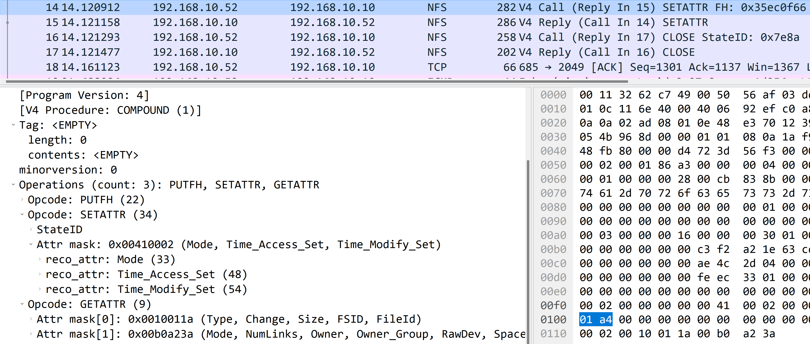

# Nfs read write

While I'm reading `wireshark 网络分析就这么简单`, it introduces NFS protocol, which is a common network file system protocol to read/write files from remote network device.

Finally I want to use wireshark to capture packages to learn the process of nfs read/write process by myself.  So let's go.

I have two machines:
```
Working machine(A):
Ip: 192.168.10.52

Nfs server machine(B):
Ip: 192.168.10.10
```

To capture the packages, I run `tcpdump` on `A`:
```shell
tcpdump -i <name> host 192.168.10.10 -w nfs_copy.cap
```
And run the following commands to read/write files to `B`:

```shell
ping -s 1 -c 1 192.168.10.10
cp empty_file /mnt/nas
ping -s 2 -c 1 192.168.10.10
cp not_empty_file /mnt/nas
ping -s 3 -c 1 192.168.10.10
cp not_empty_file /mnt/nas/empty_file
ping -s 4 -c 1 192.168.10.10
cp empty_file /mnt/nas/not_empty_file
ping -s 5 -c 1 192.168.10.10
rm /mnt/nas/emp
ping -s 6 -c 1 192.168.10.10
rm /mnt/nas/not_emp
ping -s 7 -c 1 192.168.10.10
# do as another unauthotrized user.
cp empty_file /mnt/nas/empty_file
```

Note that there are some `ping` commands with different package size(specified by `-s`).  It helps us to setup boundary between commands, then we can read packages from wireshark a lot easier.

Ok, after I run these commands, `tcpdump` has captures enough packages for me, I can ananlyzed from `wireshark`.

Here we go.

## What happened if I copy empty file to B?
Here is wireshark screenshot:

It composed of the following process:
- A: get attributes from `/mnt/nas` (which is the target we want to write to)
- B: return attributes of `/mnt/nas`
- A: check what permission I have of `/mnt/nas`
- B: return permissions
- A: lookup `/mnt/nas/empty_file` to check if it exists
- B: return `NFS4ERR_NOENT`
- A: ok, then I open `/mnt/nas/empty_file` with `OPEN4_CREaTE` type.
- B: return relative `StateID`
- A: make an `OPEN_CONFIRM` operation
- B: confirmed
- A: set attribute of opened file `/mnt/nas/empty_file`
- B: return `OK`
- A: closing relative `StateID`
- B: return `OK`

Yeah, it looks pretty intuitive, right?  Let's look into more detail:

### get attributes from `/mnt/nas`
Here is relative screenshot:

Actually it's composed with the following 2 operations:
1. `PUTFH` - it sets current file handle.
2. `GETATTR` - it gets attributes from file handle.

Here we can observed that in nfs, when you want to do something, normally you need to setup current file handle to let server knows which file/directory you want to deal with, and then you run other functions, you no-longer need to pass relative file handler to server again.  It can improve performance because you don't need to pass file handler you want to operate on again and again.

And you can notice that it says the procedure is a `COMPOUND` procedure:

Which we'll explained it later.

What server response?

If server returns ok, it'll response operations which send from client.
1. `PUTFH` - returns `NFS4_OK`
2. `GETATTR` - returns `NFS4_OK`, along with attributes

#### About COMPOUND procedure
Refer to [rfc](https://www.rfc-editor.org/rfc/rfc7530#section-15.2.4), server will executes operations which is send from client, execute these operations one by one.  If the first operation is ok, it executes second one, until one is failed(in the case it will abort operations), or no more operations to execute.

### check access

It's composed with the following 3 operations:
1. `PUTFH` - again, it sets current file handle.
2. `ACCESS` - check if the user have read/write or other access
3. `GETATTR` - again, get current file handle's attributes

### lookup /mnt/nas/empty_file to check existance

It's composed with the following operations:
1. `PUTFH`
2. `LOOKUP`
3. `GETFH`
4. `GETATTR`
And yeah, because the file doesn't exist, the server returns `NFS4ERR_NOENT`

And we can imagine that if the file exists, `GETFH` will try to get file handler of `/mnt/nas/emptyfile`

### Open the file

It's composed with the following operations:
1. `PUTFH`
2. `OPEN`
3. `GETFH`
4. `GETATTR`

One thing to note that for `OPEN` operation, the relative open type is `OPEN4_CREATE`, and the create mode is `EXCLUSIVE4`, which will acquire a lock to open the file.  So if the file is exists, the open type won't be `OPEN4_CREATE`.
And once `OPEN` is complete, we use `GETFH` to get opened files' handler.

### Open confirm
Refer to [rfc](https://www.rfc-editor.org/rfc/rfc7530#section-9.1.11), the open-owner is being used for the first time, so we need to fire an open confirm requests.

And yeah, after open the file, server tells the client that open confirm operation is required.


### Set attributes of opened file

It's composed with the following operations:
1. `PUTFH`
2. `SETATTR`
3. `GETATTR`

Yeah because we just create an empty file, and it didn't include any write operation, we just invoke `SETATTR` as if we write an empty file.

Finally we closed the opened file.

## What happened if I copy non empty file to B?
Here is wireshark screenshot:

Actually it's nearly the same to copy empty file to B:
- A: get attributes from `/mnt/nas`
- B: reuturn attributes of `/mnt/nas`
- A: lookup `/mnt/nas/non_empty_file` to check if it exists
- B: return `NFS4ERR_NOENT`
- A: ok, then I open `/mnt/nas/non_empty_file` with `OPEN4_CREATE` type.
- B: return relative `StateID`
- A: set attribute of opened file `/mnt/nas/non_empty_file`
- B: return `OK`
- A: write data to `/mnt/nas/non_empty_file`, which starts with offset 0, length is 7
- B: return `OK`
- A: closing relative `StateID`

In the process, it doesn't check the permission of `/mnt/nas`, because it's checked previously, we don't need to check it again in the same client.  The same to `OPEN_CONFIRM`, because the owner doesn't used for the first time.

One new thing here is `WRITE` operation:

It's composed of the following operations:
1. `PUTFH`
2. `WRITE`
3. `GETATTR`

## What happened if I remove a file from B?
Much simpler:

A: check what permission I have for `/mnt/nas`
B: return permissions
A: get attributes from `/mnt/nas/empty_file`
B: return attributes of `/mnt/nas/empty_file`
A: fire an remove operation
B: return `OK`

One new thing here is `REMOVE` operation, which is shown in screenshots above, it takes the parent directory as current file handler, and pass file name to REMOVE argument, then delete the file.

## What happened if un-authorized user copy a file to B?
The server will return `NFS4ERR_ACCESS` for `OPEN` operation:


## Conclusion
Nothing special, this blog just shows basic process read/write operations through NFS, hope it reveals the underlying mistries
