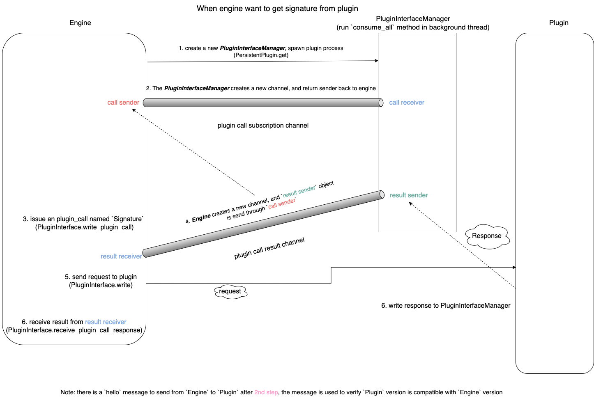
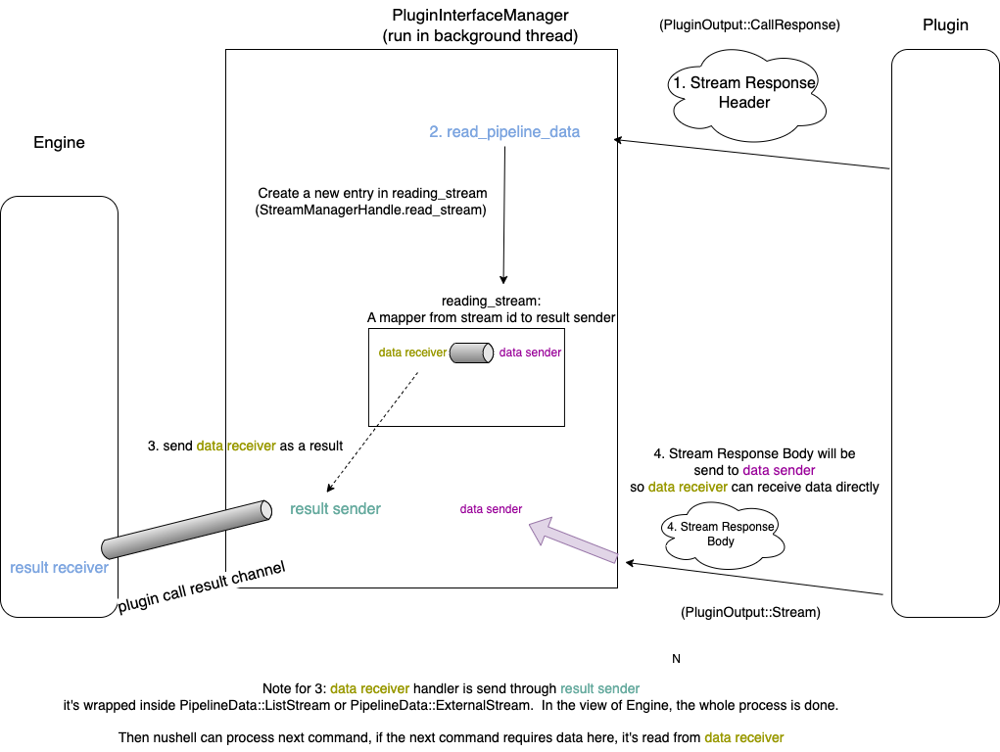

# How nushell plugin system work

Recently there is a big improvement on nushell plugin system:

1. [Bidirectional communication and streams for plugins](https://github.com/nushell/nushell/pull/11911)
2. [Keep plugins persistently running in the background](https://github.com/nushell/nushell/pull/12064)

Here I will write how the new system work.

Recall how to run a command from a plugin:
1. register the plugin (e.g: `register ./target/debug/plugin_bin`)
2. run the command directly.


## Register the plugin
For example: [nu_plugin_example]() defines many commands, like: `example one`, `example two`, `example three`.  Nushell needs to have a way to get these commands' signature.  

The process can be describe as the following:
```
nushell             plugin
  |  1. start plugin   |
  | ---------------->  |
  |    binary          |
  |                    |
  |                    |
  |  2. get signature  |
  | -----------------> |
  |                    |
  |                    |
  |  3. response       |
  | <----------------  |
  |                    |
  |                    |

```

When we want to register a plugin, nushell will run the plugin binary and get all command signatures from a plugin.  All the interesting things lays inside [get_signature](https://github.com/nushell/nushell/blob/40f72e80c3a4d35ea58405539cee056e0e77653e/crates/nu-plugin/src/plugin/mod.rs#L214) function.

### How `get_signautre` works
I drawed a diagram to show hot it works at high level:



#### make_plugin_interface
To get signatures from plugin, nushell will `make_plugin_interface` to enable communication between `engine` and `plugin` in background, in `make_plugin_interface`, it will create a `PluginInterfaceManager` object, this is the core datastructure of new plugin system, it manages communication between nushell and plugin.  Here is code snippet:

```rust
let mut manager = PluginInterfaceManager::new(source.clone(), (Mutex::new(stdin), encoder));
manager.set_garbage_collector(gc);
let interface = manager.get_interface();
interface.hello()?;
// Spawn the reader on a new thread. We need to be able to read messages at the same time that
// we write, because we are expected to be able to handle multiple messages coming in from the
// plugin at any time, including stream messages like `Drop`.
std::thread::Builder::new()
    .name(format!(
        "plugin interface reader ({})",
        source.identity.name()
    ))
    .spawn(move || {
        if let Err(err) = manager.consume_all((reader, encoder)) {
            log::warn!("Error in PluginInterfaceManager: {err}");
        }
        // If the loop has ended, drop the manager so everyone disconnects and then wait for the
        // child to exit
        drop(manager);
        let _ = child.wait();
    })
    .map_err(|err| ShellError::PluginFailedToLoad {
        msg: format!("Failed to spawn thread for plugin: {err}"),
    })?;
```

Then nushell will send `PluginCall::Signature` message to plugin.  But it's worth to look at the definition of `PlugininterfaceManager` first.
```rust
#[derive(Debug)]
#[doc(hidden)]
pub struct PluginInterfaceManager {
    // ...
    /// Receiver for plugin call subscriptions
    plugin_call_subscription_receiver: mpsc::Receiver<(PluginCallId, PluginCallState)>,
    // ...
}

impl PluginInterfaceManager {
    pub fn new(
        source: Arc<PluginSource>,
        writer: impl PluginWrite<PluginInput> + 'static,
    ) -> PluginInterfaceManager {
        let (subscription_tx, subscription_rx) = mpsc::channel();

        PluginInterfaceManager {
            state: Arc::new(PluginInterfaceState {
                source,
                plugin_call_id_sequence: Sequence::default(),
                stream_id_sequence: Sequence::default(),
                plugin_call_subscription_sender: subscription_tx,
                error: OnceLock::new(),
                writer: Box::new(writer),
            }),
            plugin_call_subscription_receiver: subscription_rx,
        }
    }
}
```

As we can see, when we create a `PluginInterfaceManager`, it will give us a channel of plugin_call_subscription.  `plugin_call_subscription_receiver` will be used in `manager.consume_call` method.  Which is called in [marke_plugin_interface](#make_plugin_interface), in background thread.

And `plugin_call_subscription_sender` will be used when we want to call plugin, nushell will use it inside `wirte_plugin_call` method.

```rust
fn write_plugin_call(
    &self,
    call: PluginCall<PipelineData>,
    ctrlc: Option<Arc<AtomicBool>>,
    context_rx: mpsc::Receiver<Context>,
) -> Result<
    (
        PipelineDataWriter<Self>,
        mpsc::Receiver<ReceivedPluginCallMessage>,
    ),
    ShellError,
> {
    let id = self.state.plugin_call_id_sequence.next()?;
    let (tx, rx) = mpsc::channel();
    // Convert the call into one with a header and handle the stream, if necessary
    let (call, writer) = match call {
        PluginCall::Signature => (PluginCall::Signature, Default::default()),
        // ...
    };
    // Register the subscription to the response, and the context
    self.state
        .plugin_call_subscription_sender
        .send((
            id,
            PluginCallState {
                sender: Some(tx),
                ctrlc,
                context_rx: Some(context_rx),
                remaining_streams_to_read: 0,
            },
        ))?;

    // Write request
    self.write(PluginInput::Call(id, call))?;
    self.flush()?;
    Ok((writer, rx))
}
```

At that level, when we `write_plugin_call`:
1. *subscribe* the call to Manager, so when manager receive response from plugin, it knows how to send response to caller.
2. send the `PluginCall` request to plugin.

#### receive_plugin_call_response
As we can see, `write_plugin_call` returns a pair of writer and channel receiver, which means we need to get response from that receiver.  That is how `receive_plugin_call_response` works.

```rust
fn receive_plugin_call_response(
    &self,
    rx: mpsc::Receiver<ReceivedPluginCallMessage>,
    mut context: Option<&mut (dyn PluginExecutionContext + '_)>,
    state: CurrentCallState,
) -> Result<PluginCallResponse<PipelineData>, ShellError> {
    // Handle message from receiver
    for msg in rx {
        match msg {
            ReceivedPluginCallMessage::Response(resp) => {
                // ...
                return Ok(resp);
            }
            ReceivedPluginCallMessage::Error(err) => {
                return Err(err);
            }
            ReceivedPluginCallMessage::EngineCall(engine_call_id, engine_call) => {
                self.handle_engine_call(
                    engine_call_id,
                    engine_call,
                    &state,
                    context.as_deref_mut(),
                )?;
            }
        }
    }
}
```

#### Summary
Given all of this, let's summarize how `get_signature` works:
1. Create a `PluginInterfaceManager`, which includes `plugin_call_subscription_sender/receiver` pair.  And receive messages in background.
2. Write `PluginCall::Signature` plugin call through `write_plugin_call` method, and wait on messages from `rx`, and result sender is send to `PluginInterfaceManager` through `plugin_call_subscription_sender`.
3. `PluginInterfaceManager` will send response when it receives output from plugin.


## How to run command

Actually it's very similar to `get_signature` from plugin, except it calls `write_plugin_call` with `PluginCall::Run`.

```rust
fn write_plugin_call(
    &self,
    mut call: PluginCall<PipelineData>,
    context: Option<&dyn PluginExecutionContext>,
) -> Result<WritePluginCallResult, ShellError> {
    // Prepare the call with the state.
    state.prepare_plugin_call(&mut call, &self.state.source)?;

    // Convert the call into one with a header and handle the stream, if necessary
    let (call, writer) = match call {
        PluginCall::Signature => (PluginCall::Signature, Default::default()),
        PluginCall::CustomValueOp(value, op) => {
            (PluginCall::CustomValueOp(value, op), Default::default())
        }
        PluginCall::Run(CallInfo {
            name,
            mut call,
            input,
        }) => {
            state.prepare_call_args(&mut call, &self.state.source)?;
            let (header, writer) = self.init_write_pipeline_data(input, &state)?;
            (
                PluginCall::Run(CallInfo {
                    name,
                    call,
                    input: header,
                }),
                writer,
            )
        }
    };
    // Register the subscription to the response, and the context
    // subscribe stream...
    // ...
    // Write request
    self.write(PluginInput::Call(id, call))?;
    self.flush()?;

    Ok(WritePluginCallResult {
        receiver: rx,
        writer,
        state,
    })
}
```

Then it finish writing the plugin call in background, this enables engine send command name and input arguments in background.  Then nushell engine can do other jobs.   Note that, it's `PluginInterfaceManager`'s job to get response from plugin, if response is `PipelineData::ListStream` or `PipelineData::ExternalStream`, the `Manager` handles stream reading logic, and then send back to engine through plugin call result channel.

The core logic lays inside `PluginInterfaceManager::consume`

```rust
fn consume(&mut self, input: Self::Input) -> Result<(), ShellError> {
    log::trace!("from plugin: {:?}", input);

    match input {
        // ....
        PluginOutput::Stream(message) => self.consume_stream_message(message),
        PluginOutput::CallResponse(id, response) => {
            // Handle reading the pipeline data, if any
            let response = response
                .map_data(|data| {
                    let ctrlc = self.get_ctrlc(id)?;
                    // Register the streams in the response
                    for stream_id in data.stream_ids() {
                        self.recv_stream_started(id, stream_id);
                    }

                    self.read_pipeline_data(data, ctrlc.as_ref())
                })
                .unwrap_or_else(|err| {
                    // If there's an error with initializing this stream, change it to a plugin
                    // error response, but send it anyway
                    PluginCallResponse::Error(err.into())
                });
            let result = self.send_plugin_call_response(id, response);
            if result.is_ok() {
                // When a call ends, it releases a lock on the GC
                if let Some(ref gc) = self.gc {
                    gc.decrement_locks(1);
                }
            }
            result
        }
        // ...
    }
}
```

`PluginInterfaceManager` uses `StreamManager` to manage streams.

### Stream Management

I drawed another diagram to show how to manage streams.



#### Receive PluginOutput::CallResponse from plugin
When plugin returns a response, it contains information to indicate the response contains a stream, so `PluginInterfaceManager` can add the stream to reading streams.

```rust
PluginOutput::CallResponse(id, response) => {
    // Handle reading the pipeline data, if any
    let response = response
        .map_data(|data| {
            // ...
            self.read_pipeline_data(data, ctrlc.as_ref())
        });
    // ...
}

// read pipeline data
fn read_pipeline_data(
    &self,
    header: PipelineDataHeader,
    ctrlc: Option<&Arc<AtomicBool>>,
) -> Result<PipelineData, ShellError> {
    self.prepare_pipeline_data(match header {
        PipelineDataHeader::ListStream(info) => {
            let handle = self.stream_manager().get_handle();
            let reader = handle.read_stream(info.id, self.get_interface())?;
            PipelineData::ListStream(ListStream::from_stream(reader, ctrlc.cloned()), None)
        }
        // ...
        // Similar to when header is PipelineDataHerder::ExternamStream
    })
}
```

Here, `handle.read_stream` will insert a new entrypoint to `reading_streams`, which is a map from stream id to pipeline data sender.

```rust
pub(crate) fn read_stream<T, W>(
    &self,
    id: StreamId,
    writer: W,
) -> Result<StreamReader<T, W>, ShellError>
where
    T: TryFrom<StreamData, Error = ShellError>,
    W: WriteStreamMessage,
{
    let (tx, rx) = mpsc::channel();
    self.with_lock(|mut state| {
        // Must be exclusive
        if let btree_map::Entry::Vacant(e) = state.reading_streams.entry(id) {
            e.insert(tx);
            Ok(())
        } else {
            // ...
        }
    })?;
    Ok(StreamReader::new(id, rx, writer))
}
```

Finally, after insert id to `reading_streams`, `read_pipeline_data` will return `PipelineData`, and it will be our response to a *plugic_call*.  Then nushell engine can process next command.

### More data comes from plugin
When more data comes from plugin, `PluginInterfaceManager` receives `PluginOutput::Stream`, in the case, the manager `consume_stream_message`.

```rust
fn consume(&mut self, input: Self::Input) -> Result<(), ShellError> {
    log::trace!("from plugin: {:?}", input);

    match input {
        // ...
        PluginOutput::Stream(message) => self.consume_stream_message(message),
        // ...
    }
}
```

For consuming, it will get stream id from `message`, and try to find it from `reading_streams`, then send data through channel.

```rust
StreamMessage::Data(id, data) => {
    if let Some(sender) = state.reading_streams.get(&id) {
        let _ = sender.send(Ok(Some(data)));
        Ok(())
    }
}
```

### Summary
So in summary, this is how `PluginInterfaceManager` manage streams:
1. When receive response from plugin, if it contains stream data, create an entry in `reading_streams`, the key is stream id, the value is result data sender channel.
2. result receiver of channel will be wrapped in `PipelineData::ListStream` or `PipelineData::ExternalStream`, and returns to nushell engine.
3. as more data returns from plugin, `PluginInterfaceManager` will get data sender channel from `reading_streams`, and send these data out.

## Reference source code:
All these code in previous sessions can be found here:
1. [make_plugin_interface](https://github.com/nushell/nushell/blob/40f72e80c3a4d35ea58405539cee056e0e77653e/crates/nu-plugin/src/plugin/mod.rs#L159): create a new `PluginInterfaceManager` and run `consume_all` in background.
2. [consume_all](https://github.com/nushell/nushell/blob/40f72e80c3a4d35ea58405539cee056e0e77653e/crates/nu-plugin/src/plugin/interface/plugin.rs#L401): run in background to consume all messages from `plugin`.
3. [consume](https://github.com/nushell/nushell/blob/40f72e80c3a4d35ea58405539cee056e0e77653e/crates/nu-plugin/src/plugin/interface/plugin.rs#L451): a main handler to consume a message, it's invoked by `consume_all`.
4. [write_plugin_call](https://github.com/nushell/nushell/blob/40f72e80c3a4d35ea58405539cee056e0e77653e/crates/nu-plugin/src/plugin/interface/plugin.rs#L651): Write a plugin call message. Returns the writer for the stream.
5. [receive_plugin_call_resposne](https://github.com/nushell/nushell/blob/40f72e80c3a4d35ea58405539cee056e0e77653e/crates/nu-plugin/src/plugin/interface/plugin.rs#L756): Read the channel for plugin call messages and handle them until the response is received.
6. [read_pipeline_data](https://github.com/nushell/nushell/blob/40f72e80c3a4d35ea58405539cee056e0e77653e/crates/nu-plugin/src/plugin/interface.rs#L179): Read PipelineData from `plugin`'s output.
7. [read_stream](https://github.com/nushell/nushell/blob/40f72e80c3a4d35ea58405539cee056e0e77653e/crates/nu-plugin/src/plugin/interface/stream.rs#L560): Register a new stream for reading.
