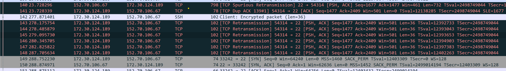

# Ssh hanged if we don't input for a long time

Recently I've notice that if I connect to a server via ssh, and don't type for a while, the relative session seems hanged and I can't do something anymore.

So I tried to capture the package to see what's going on

## Preparation
In both client side and server side, running a tcpdump to capture packages,

Client side: `sudo tcpdump -i xxx host <server> -w auto_disconnect.cap`
Server side: `sudo tcpdump -i xxx port 22 -w server_auto_disconnect.cap`

After connecting to server, type something, then wait for 5 seconds, then try to type something, it should hanged.
Then connect to the server via another session, kill server's tcpdump process, we can get the captured packages.

## Captured result
Here is client side result:


As we can see, after a long time, when we type something, our client send out TCP Retransmission package, it can't reach server anymore.

But while checking server side result, it's really normal, it doesn't receive package from client.  So the package is lossed from client side to server side:

```
        package
client ---xxxx---> server
```

So it seems that there are some routers close our connection, but our client don't know that.  And it only happened if I don't input something for a long time, so the solution seems to be make client send heartbeat to server.

## Solution
After checking from [stackoverflow](https://superuser.com/questions/699676/how-to-prevent-ssh-from-disconnecting-if-its-been-idle-for-a-while), we can do something like:

```
Per command:

Therefore you should consider to set

ssh -o "ServerAliveInterval 60" -o "ServerAliveCountMax 120" <SERVER_ADDRESS>

Persistent:

To make it persistent write it to /etc/ssh/ssh_config (will apply system-wide) or ~/.ssh/config (will apply user-only):

ServerAliveInterval 60
ServerAliveCountMax 120
```

The reason why the connection is disconnected in the middle is complicated, here I copied from [stackexchange](https://serverfault.com/questions/611265/ssh-connection-after-some-time-i-cant-type-anything) to know about why something like this happened:

```
You have a NAT router or a similar stateful firewall between your client and the server. When you opened the TCP session, the firewall remembered that a TCP connection was created between your client port and the server port. As long as the firewall remembers the connection, it will continue passing packets between the client and the server.

The session "breaks" because the firewall forgets about the connection and stops passing packets through. The firewall may forget about the connection because it has a timeout on idle connections. Or it could forget because it has a limited amount of memory and too many new connections were being created for it to remember all of them.

ssh has some options to work around this by sending periodic "keep-alive" packets when the connection is idle. Look at the TCPKeepAlive, ServerAliveInterval, and ServerAliveCountMax options.
```
