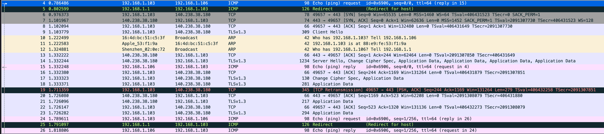
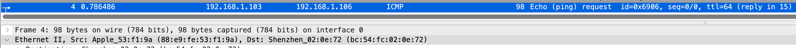
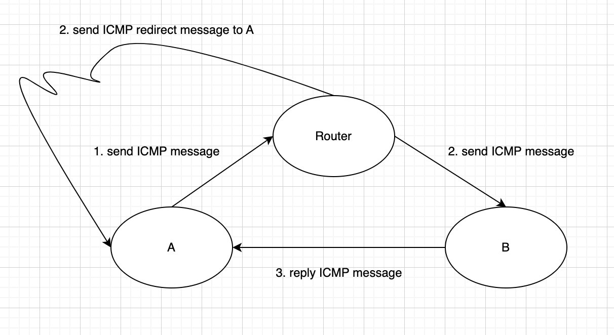
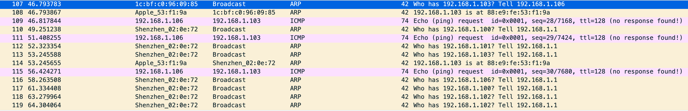

# Subnet and subnet mask, simple ICMP bahavior

The problem comes from the book: if I have two machines in the same network, but wrongly configure one machine's subnet mask, can they communicate?

Take the following as example, I have two machines, one apple, one windows, their ip address are configured as following:

```
Apple machine(A):
Ip: 192.168.1.103
Subnet mask prefix length: 29(255.255.255.248)
MAC: xx:xx:xx:xx:f1:9a
Default gateway: 192.168.1.1

Windows machine(B):
Ip: 192.168.1.106
Subnet mask prefix length: 24(255.255.255.0)
MAC: xx:xx:xx:xx:09:85
Default gateway: 192.168.1.1

Router:
Ip: 192.168.1.1
MAC: xx:xx:xx:xx:0e:72
```

What happened when A ping B, and what happened when B ping A.

## What happened when A ping B
I'm using wireshark to capture all packages on A, here is the result:


So what happened to A are:
1. A sends ICMP request to router(because B have different network number to A, A needs to send to default gateway), we can verify it by check `Dst` of `Ethernet II` layer.

2. B received ICMP package from router, it thinks that A and B belongs to the same network(because B's subnet mask prefix length is 24, after applying subnet mask on both A's Ip and B's Ip, they have the same network number)
3. A received ARP package from B to query on mac address
4. A reply to B on ARP package
5. B sends ICMP response message to A directly

And notes that there is a package from router to A:


Because router found that A and B belongs to the same network, A can send to B directly.

It can be expressed as the following diagram:


## What happened when B ping A
I'm using wireshark to capture all packages on A, here is the result:


So what happened to A are:
1. A received an ARP package from B to query on mac address
2. A reply to B on ARP package
3. B sends ICMP package to A directly
4. A received ICMP package, but figure out B have a different network number to A, it just drop the package and don't reply to B.
