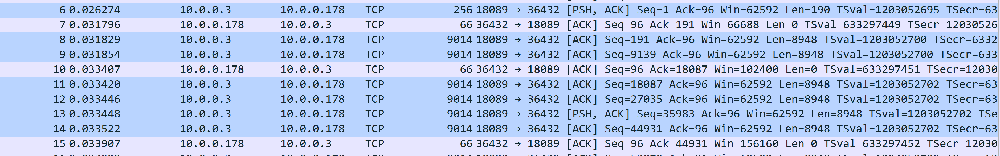
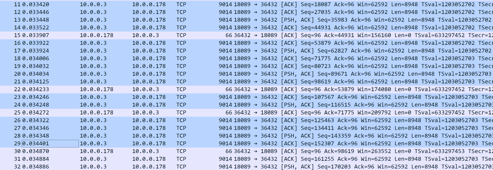

# Tcp slow start

Today I want to use wireshark to know how tcp slow start works.

## Background

Initially, when two computer established a tcp connection, there are two factors to desice how many data a sender can send to a receiver:
1. sender's send buffer size.
2. receiver's recv buffer size.

It's something called sliding window algorithm on transmission control.

But it's not that simple:

When a sender needs to send data to a receiver, the sender can't send data really quickly at first, or else the network will become congested easily.  But this sender can't send data really slow, which is really inefficient.  To solve the issue, tcp uses a slow start algorithm, which is basically like this:
1. sender send 1 package to receiver
2. receiver acked, then sender send 2 packages to receiver
3. receiver acked, then sender send 4 packages to receiver

In generally, if there are `n` packages are acked at a time, it indicated that the sender can send `2 * n` packages.  Until sender detects congestion has happened(like a retramissiong is happended), and then falls into congestion avoid algorithm.  And there is a term `congestion window(cwnd)` to indicate the relative window size.

## Capture tcp messages to investigate tcp slow start algorithm
Here I have two machines:
1. sender machine(S)
2. receiver machine(R)

And sender machine send a 2M file to receiver machine.  By the following steps:
1. open an simple http server on sender machine: `python3 -m http.server 18089`
2. on sender machine, run tcpdump to capture packages: `sudo tcpdump -i <interface> host <receiver's ip> -s 80 -w tmp.cap`
3. on receiver machine, run `curl` command to fetch the `2M` file: `curl -O http://<receiver's ip>:18089/a_2m_file`

But before we do the previous step, we need to do some prepration to make sure that we can see tcp slow start algorithm easily
### Preparation
As we discussed previously, how many package a sender can send can be summarized to: `min(sender's remaining buffer size, receiver's remaining buffer size, cwnd)`.

Currently `cwnd` is what we interested, so we want to make `sender's buffer size` and `receiver's buffer size` as large as possible, so, let's go:
1. setting `sender's buffer size`: `sysctl -w net.ipv4.tcp_wmem = 4194304 4194304 4194304`
2. setting `receiver's buffer size`: `sysctl -w net.ipv4.tcp_rmem = 6291456 6291456 6291456`

Is it done?  Unfortuanlly it's not, in nowadays linux system, the initial size of `cwnd` is `10`, we need to adjust it to `1` on sender side: `sudo ip route change x.x.x.x/24 dev <interface> proto static initcwnd 1`.

And we also need to make sure that the network card offload feature is off, so we can see packages which size are restrictly less or equal to `MSS`:
- `sudo ethtool -K <interface> gso off`
- `sudo ethtool -K <interface> tso off`.
For more information about offload, you can check the following page: https://rtodto.net/generic_segmentation_offload_and_wireshark/

Ok, we're done, here we go!

## Captured result
After we've done these steps, we should have a `tmp.cap` file which captures tcp segments.  Then we open it with `wireshark`, here is the result:

As we can see, the highlighted parts are packages from sender to receiver, and we can see that it sends out 1 package, waiting for ACK.  Then it sends out 2 packages, waiting for ACK, then it sends out 4 packages.

Ok that's cool, let's continue:

Sender sends out 4 packages, receive an ACK, sender sends out ***6*** packages, receive an ACK, sender sends out 2 packages, receive an ACK, sender sends out 4 packages..

It's stranged, accoring to slow start algorithm, when sender sends out 4 packages and receive an ACK, it should sends out ***8*** packages rather than ***6***, what happened?

...

We can look back to the ACK package(which didn't highlighted), take `number 15` as example, according to `Ack` field, it just tell sender that it had received `number 11`, `number 12`, `number 13`, which are 3 packages rather than 4.  So sender should send out just `3 * 2 = 6` packages.

The same thing happened on `number 22`, it actually acked one package: `number 14`, then sender sends out `1 * 2 = 2` packages.  The same to the ACK package `number 25`.  So it can be summarized like as following:

> Once a received acked `n` packages in one ACK, the sender send out `2 * n` packages.

Needs to know that it's not strictly `2 * n`, I've done some other experiment, and it don't always follow the rule, but it's not important, the most important thing is that: it sends out more packages after an ACKED was received.  And it grows really quickly.
