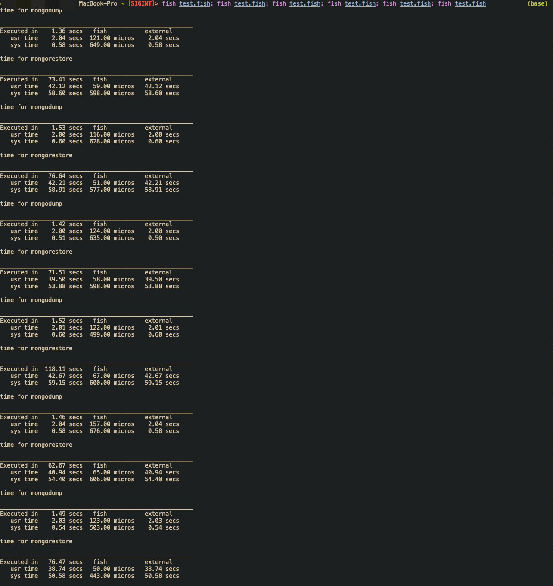
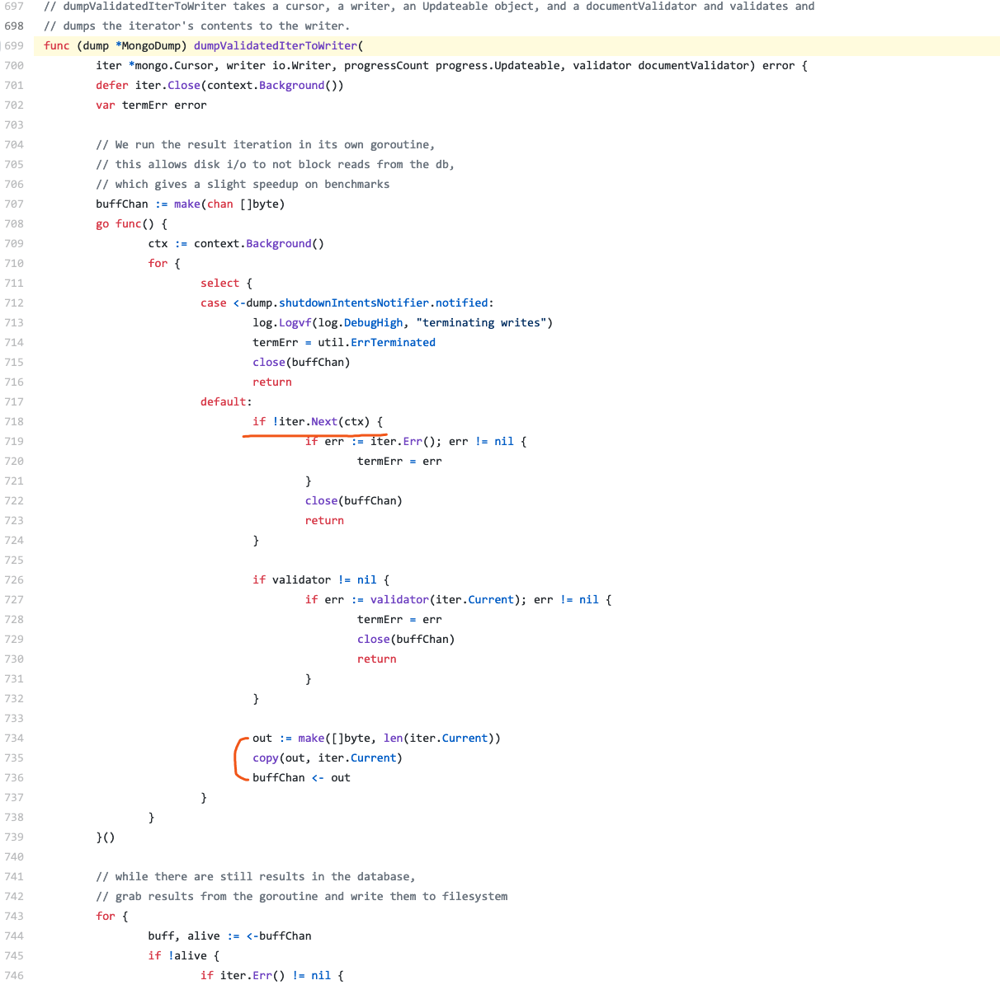

## Why mongodump is fast
With curiosity, I have written a mongo database Synchronizer which synchronize from one database to other database.

When I finish this, I try to benchmark it with `mongodump/mongorestore` pair. Surprisingly, `mongodump` is super faster than my hypothesis.

### Benchmark
#### Scenario
A database with 4 collection, each collection have 1,000,000 document, every document is `{"a": "b"}`, no index for each collection.

The mongodb is deployed in my local machine.

#### Result
Here is my testing result:

MongoSync:


Relative configuration:

```toml
[src]
# source db url, need to be a replica set.
url = "mongodb://localhost/?authSource=admin"

[dst]
# target db url, don't need to be a replica set.
url = "mongodb://remote_address/?authSource=admin"

[sync]
# specify databases to sync
db = "bb"
collection_concurrent = 4
sync_buffer_size = 10000
```

Mongodump/MongoRestore:



Relative fish script:

```fish
function run_dump_restore
    echo "time for mongodump"
    time mongodump -h localhost -d bb 1>/dev/null 2>/dev/null
    echo "time for mongorestore"
    time mongorestore -h remote_address --authenticationDatabase=admin --drop 1>/dev/null 2>/dev/null
end

run_dump_restore
```

##### Running time conclusion
1. My implementation: takes about 78 seconds.
2. Mongodump/Mongorestore: mongodump takes 1.46 seconds to dump to local bson file, mongorestore takes 79.8 seconds to restore data to database.

It seems that my implementation is ok (some times even faster than mongodump/mongorestore), but here is one more problem: why mongodump so fast?

Nomally, I think the process to sync a database is:
1. sync every collection inside a database.
2. for each collection, just read one document one by one.  Make these documents in a writing cache, flush cache into target collection.  (we can use more threads in this step.)

So mongodump should normally do the same progress, but write data to local dumped file, but why it's so fast?

### Why mongodump is fast

I'm trying to find what's mongodb implementation, and find something like this, the source code can be referred from [here](https://github.com/mongodb/mongo-tools/blob/7e0f0dc16459f5dbff7ce7c17d75d149d8a67aaa/mongodump/mongodump.go#L699):



Hmm... It seems nothing special, `mongodump` is just iterating cursor, and copy the data to output buffer.  Oh...wait, what's the meaning of this?

```go
out := make([]byte, len(iter.Current))
```

It seems that iter.Current just return `bytes`.  Let's go into the definition, Oh, it's [here](https://github.com/mongodb/mongo-go-driver/blob/60f76f5b1810553090503950fce37c876253217b/mongo/cursor.go#L25):

```go
type Cursor struct {
	// Current contains the BSON bytes of the current change document. This property is only valid until the next call
	// to Next or TryNext. If continued access is required, a copy must be made.
	Current bson.Raw

	bc            batchCursor
	batch         *bsoncore.DocumentSequence
	batchLength   int
	registry      *bsoncodec.Registry
	clientSession *session.Client

	err error
}
```

The `Cursor.Current` is just `bson.Raw`, which is just `bytes[]`.

So I think here is the reason, when `mongodump` read data from source, it just get ***bson bytes***, and don't need to *Deserialize* bytes to document.  In my scenario, it means that `mongodump` don't need to *Deserialize* 4,000,000 documents, which can save a lot of time.

### Conclusion
Nothing special :-)
